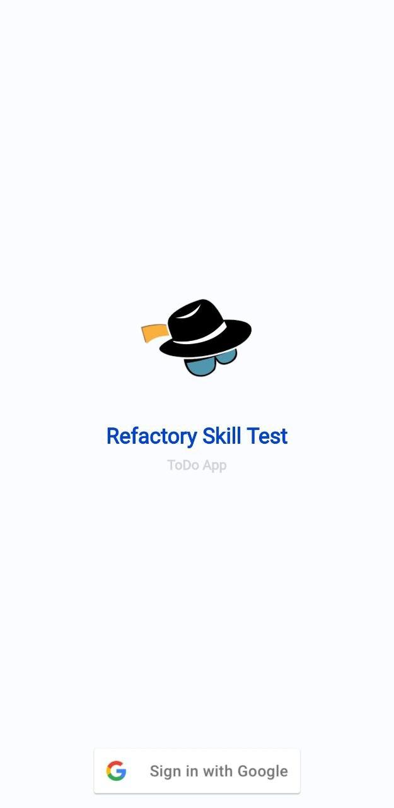
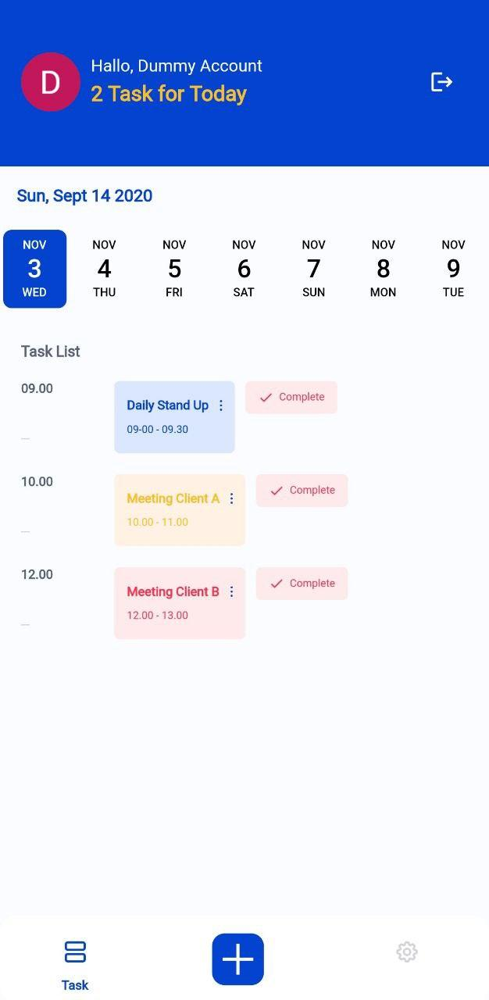

# Refactory Skill Test

A new Flutter project (ToDo App).

## Getting Started

This project is a starting point for a Flutter application.

A few resources to get you started if this is your first Flutter project:

- [Lab: Write your first Flutter app](https://flutter.dev/docs/get-started/codelab)
- [Cookbook: Useful Flutter samples](https://flutter.dev/docs/cookbook)

For help getting started with Flutter, view our
[online documentation](https://flutter.dev/docs), which offers tutorials,
samples, guidance on mobile development, and a full API reference.

## Preview App

Login Page             |  Home Page
:-------------------------:|:-------------------------:
  |  


#### File placement:
```
- Logic Test (Test Bootcamp 2/logic_test/)
- Assets (assets/)
- Use Router (lib/routes/route.dart)
- Use Theme (lib/theme.dart)
- Use Auth (lib/utils/authentication.dart)
- Use Widget (lib/apps/widget/)
- Use Cubit (cubit/page_cubit.dart)
```

#### dependencies:
```
- cupertino_icons: ^1.0.2
- google_fonts: ^2.1.0
- flutter_bloc: ^7.3.0
- date_picker_timeline: ^1.2.3
- firebase_core: ^1.8.0
- firebase_auth: ^3.1.4
- google_sign_in: ^5.0.7
```

Integrate Flutter Google SignIn With Firebase to allow user authentication in your Flutter app.
[Link to Tutorial](https://blog.codemagic.io/firebase-authentication-google-sign-in-using-flutter/)